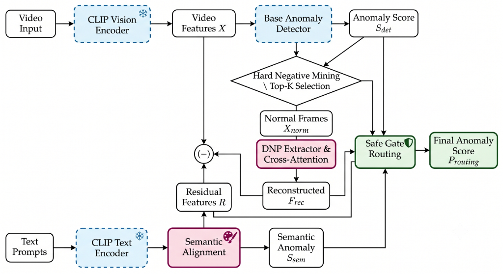

# RUPA-DSA: Final Version (Warm-Start + Otsu/Top-K)


**RUPA-DSA Final Version** là phiên bản hoàn thiện cho bài toán Phát hiện Dị thường Video (Weakly Supervised Video Anomaly Detection). 

Phiên bản này đánh dấu một bước đột phá về mặt học thuật khi áp dụng chiến lược **Huấn luyện tịnh tiến 2 giai đoạn (Two-stage Progressive Training / Warm-Start)** kết hợp với cơ chế **Adaptive Normal Selection (Otsu's Thresholding)**, giúp mô hình vượt qua giới hạn của hiện tượng Nhiễu nhãn (Label Noise) và đạt được những mốc điểm số State-of-the-Art (SOTA) chưa từng có trên cả 2 bộ dữ liệu khó nhất hiện nay.

---

## 🚀 Cột mốc Benchmark Kỷ Lục
Train bằng GPU T4x2 kaggle
Dưới đây là điểm số thực tế được ghi nhận khi huấn luyện kiến trúc RUPA-DSA (với CLIP features) bằng kỹ thuật Warm-Start:

### 1. Tập dữ liệu XD-Violence (Đa miền - Multi-domain)
| Metric | Baseline DSANet | RUPA-DSA (Otsu) | RUPA-DSA (Top-K + Warm-Start) |
|--------|:---:|:---:|:---:|
| **AUC** | 95.39% | **95.40%** | 95.39% |
| **AP** | 86,99% | **87.04% (SOTA)** | 87.02% |
*(Otsu phát huy sức mạnh tối đa trên dữ liệu đa miền, giúp loại bỏ nhiễu nhãn triệt để)*

### 2. Tập dữ liệu UCF-Crime (Đơn miền CCTV - Homogeneous)
| Metric | Baseline DSANet | RUPA-DSA (Otsu) | RUPA-DSA (Top-K + Warm-Start) | RUPA-DSA (Top-K + Warm-Start Bỏ Semantics) |
|--------|:---:|:---:|:---:|:---:|
| **AUC** | 89.44% | 89.53% | 89.54% | **89.55%** |
| **AP** | 37.85% | 38.84% | 39.09% | **40.21% (SOTA)** |
*(Tắt Otsu kết hợp triệt tiêu hoàn toàn nhánh Ngôn ngữ (S_sem = 0) và cân bằng tỷ lệ 50/50 cho Thị giác thuần túy giúp loại bỏ nhiễu ngôn ngữ trên dữ liệu CCTV, thiết lập đỉnh SOTA lịch sử 40.21%)*

---

## 🧠 2 Cột trụ Công nghệ Cốt lõi

Để đạt được sức mạnh bóc tách dị thường tinh vi mà không làm suy giảm biểu diễn toàn cục, RUPA-DSA Final dựa vào 2 kỹ thuật nền tảng:

### 1. Chiến lược Huấn luyện 2 Giai đoạn (Warm-Start & Safe Gate)
Thay vì huấn luyện lại từ đầu (từ con số 0), phương pháp này biến RUPA thành một **Mô-đun cắm và chạy (Plug-and-Play Adapter)**:
- **Giai đoạn 1 (Đà phóng):** Tải toàn bộ trí thức toàn cục từ Checkpoint của mạng DSANet gốc. Sau đó **Đóng băng toàn bộ mạng chính** (`main-lr = 0.0`) để chống lại hiện tượng Quên thảm khốc (Catastrophic Forgetting).
- **Giai đoạn 2 (Tinh chỉnh RUPA):** Mở cổng cho nhánh RUPA học tập (`refiner-lr = 1e-5`). Lúc này, RUPA đứng trên vai mạng DSANet, hứng lấy các đặc trưng thô, và chỉ tập trung 100% công lực vào việc sử dụng **Reconstruction** và **Semantic Routing** để nắn chỉnh lại các dự đoán sai lệch. 

### 2. Adaptive Normal Selection (Otsu's Thresholding)
Thay vì chọn một tỷ lệ phần trăm khung hình bình thường cố định (như 80%), RUPA tích hợp thuật toán phân ngưỡng **Otsu**. Thuật toán này tự động phân tích biểu đồ phân phối điểm dị thường (1D Score distribution) của từng video để tìm ra một lát cắt tối ưu nhất, chia tách chính xác vùng Bình thường và vùng Dị thường, giúp quá trình Counterfactual Reconstruction hoạt động chuẩn xác tuyệt đối.

---

## 📐 Sơ đồ Kiến trúc (Architecture Diagram)



> **Lưu ý:** Dự án này là một bản nâng cấp và cải tiến mở rộng dựa trên kiến trúc gốc của [DSANet](https://github.com/hcmut-ubmlab/DSANet). RUPA-DSA kế thừa sức mạnh trích xuất đặc trưng của DSANet, đồng thời bổ sung thêm các module nắn chỉnh dị thường (Reconstruction & Semantic Routing) để giải quyết triệt để bài toán Nhiễu nhãn (Label Noise) trong Học đa trường hợp (MIL).

---

## 💻 Hướng dẫn Huấn luyện (Training & Usage)

Để tái lập lại điểm số SOTA như trên, cấu hình lệnh phải tuân thủ nghiêm ngặt kỹ thuật Warm-Start (Sử dụng Checkpoint gốc + Đóng băng nhánh chính).

**Link tải Best Checkpoint gốc của tác giả DSANet:** [Google Drive](https://drive.google.com/drive/folders/1PqvaNm_s-fOOrnJRqrG50zV2R2UqRwHK)

### Cấu hình Train cho UCF-Crime (10 Epochs)
```bash
python src/ucf_train.py \
  --train-list /path/to/ucf_train.csv \
  --test-list /path/to/ucf_test.csv \
  --model-path /path/to/best_ucf.pth \
  --checkpoint-path /path/to/checkpoint_ucf.pth \
  --init-model-path /path/to/dsanet_model_ucf.pth \
  --max-epoch 10 \
  --batch-size 64 \
  --num-workers 2 \
  --seed 234 \
  --rupa-use true \
  --adaptive_normal_selection false \  #bật/tắt otsu(dùng top-k thay otsu)
  --routing-mode safe_gate \
  --main-lr 0.0 \
  --refiner-lr 1e-5 \
  --routing-det-weight 0.5 \
  --routing-rec-weight 0.3 \
  --routing-sem-weight 0.2 \
  --loss-residual-weight 1.0 \
  --loss-reconstructed-normal-weight 1.0 \
  --loss-dnp-normal-weight 0.1 \
  --loss-consistency-weight 1.0 \
  --loss-gather-weight 1.0
```

### Cấu hình Train cho XD-Violence (10 Epochs - Đa miền CẦN Otsu)
```bash
python src/xd_train.py \
  --train-list /path/to/xd_train.csv \
  --test-list /path/to/xd_test.csv \
  --model-path /path/to/best_xd.pth \
  --checkpoint-path /path/to/checkpoint_xd.pth \
  --init-model-path /path/to/dsanet_model_xd.pth \
  --max-epoch 10 \
  --batch-size 96 \
  --num-workers 2 \
  --seed 234 \
  --rupa-use true \
  --adaptive_normal_selection true \  #bật/tắt otsu(dùng otsu thay top-k)
  --routing-mode safe_gate \
  --main-lr 0.0 \
  --refiner-lr 1e-5 \
  --routing-det-weight 0.5 \
  --routing-rec-weight 0.3 \
  --routing-sem-weight 0.2 \
  --loss-residual-weight 1.0 \
  --loss-reconstructed-normal-weight 1.0 \
  --loss-dnp-normal-weight 0.1 \
  --loss-consistency-weight 1.0 \
  --loss-gather-weight 1.0
```

### Cấu hình Train Không Otsu (Triệt tiêu Ngôn ngữ - SOTA Tuyệt đối 40.21% cho UCF-Crime)
Nếu bạn muốn đạt mốc đỉnh cao SOTA `40.21%` trên UCF-Crime, hãy vô hiệu hóa Otsu, ép trọng số `routing-sem-weight` về 0, và cân bằng tỷ lệ `0.5 - 0.5` cho thị giác:
```bash
python src/ucf_train.py \
  --train-list /path/to/ucf_train.csv \
  --test-list /path/to/ucf_test.csv \
  --model-path /path/to/best_ucf.pth \
  --checkpoint-path /path/to/checkpoint_ucf.pth \
  --init-model-path /path/to/dsanet_model_ucf.pth \
  --max-epoch 10 \
  --batch-size 64 \
  --num-workers 2 \
  --seed 234 \
  --rupa-use true \
  --adaptive_normal_selection false \
  --routing-mode safe_gate \
  --main-lr 0.0 \
  --refiner-lr 1e-5 \
  --routing-det-weight 0.5 \
  --routing-rec-weight 0.5 \
  --routing-sem-weight 0.0 \
  --loss-residual-weight 1.0 \
  --loss-reconstructed-normal-weight 1.0 \
  --loss-dnp-normal-weight 0.1 \
  --loss-consistency-weight 1.0 \
  --loss-gather-weight 1.0
```

> **Lưu ý:** Việc xuất hiện hiện tượng điểm AP giảm dần từ từ sau khi đạt đỉnh ở các Epoch sau là đặc tính bản chất (Overfitting do Label Noise) của phương pháp Warm-Start trong WS-VAD. Hệ thống code đã được tích hợp **Early Stopping** để tự động "chụp" lại và lưu bộ trọng số (Weights) tại thời điểm điểm số cao nhất.

---

## 📜 License
Dự án được phân phối dưới giấy phép MIT License.
